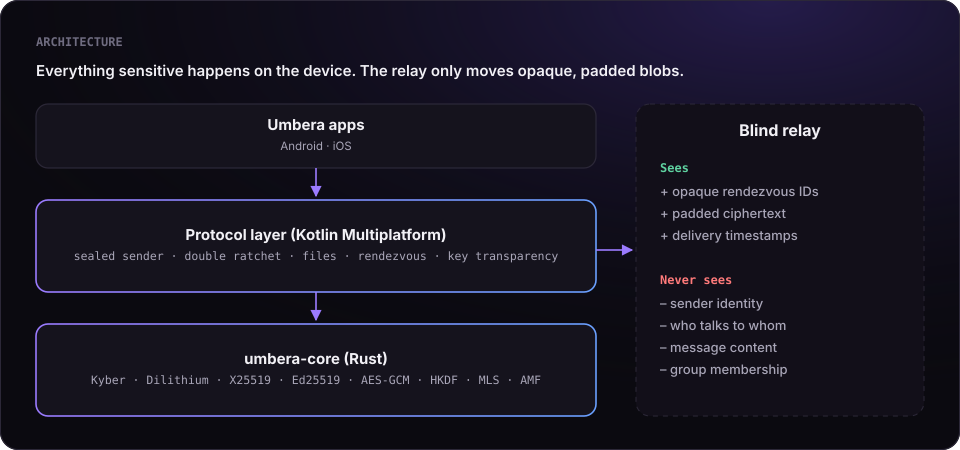
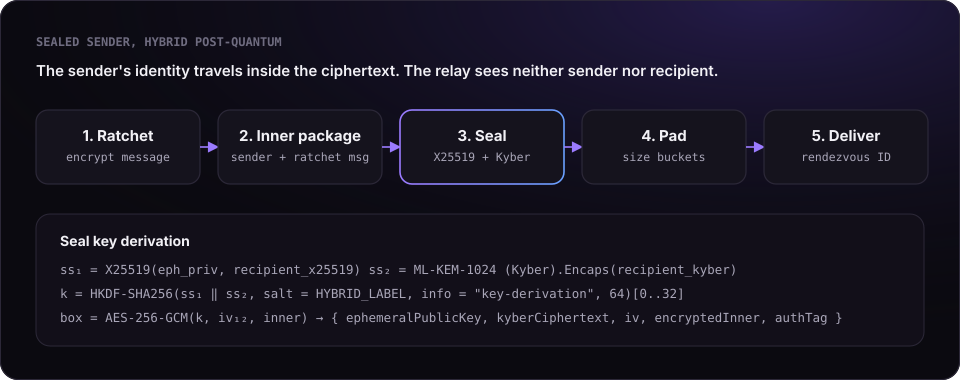
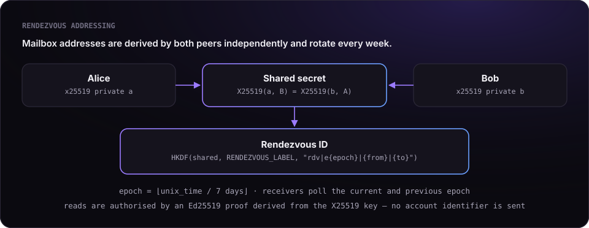
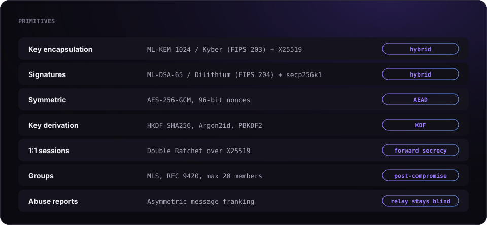

<a id="top"></a>

<p align="center">
  
</p>

<p align="center">
  <a href="LICENSE.md"></a>
  
  
  
  
</p>

<p align="center">
  <a href="https://umbera.app"></a>
  <a href="https://apps.apple.com/app/id6805525799"></a>
  <a href="https://play.google.com/store/apps/details?id=cc.umbera.app"></a>
  <a href="https://x.com/umberaapp"></a>
</p>

<p align="center">
  <a href="docs/PROOF.md"></a>
  <a href="docs/PROOF.md#1-messages"></a>
  <a href="docs/PROOF.md#2-calls"></a>
  <a href="docs/PROOF.md#run-it-yourself"></a>
</p>

<p align="center">
  <a href="docs/PROTOCOL.md"></a>
  <a href="core"></a>
  <a href="kotlin"></a>
  <a href="SECURITY.md"></a>
  <a href="LICENSE.md"></a>
</p>

---

**Umbera** is a private messenger built on one rule: *the server should never know who talks to whom.*
This repository contains the code that enforces that rule — the cryptographic core that runs on every
Umbera device. It is published so that anyone can read it, run its tests and check our claims.

> No phone number. No email. Post-quantum end-to-end encryption. Sealed sender.
> A relay that moves padded ciphertext between rotating mailbox addresses and learns nothing else.

## Contents

| This page | Proof | Protocol specification |
|---|---|---|
| [Why this repository exists](#why-this-repository-exists) | [The claims](docs/PROOF.md#the-claims) | [What the relay sees](docs/PROTOCOL.md#2-what-the-relay-sees) |
| [Architecture](#architecture) | [Assumptions](docs/PROOF.md#assumptions) | [Hybrid key agreement](docs/PROTOCOL.md#4-hybrid-key-agreement) |
| [How a message travels](#how-a-message-travels) | [Messages](docs/PROOF.md#1-messages) | [Double Ratchet](docs/PROTOCOL.md#5-one-to-one-sessions-double-ratchet) |
| [Cryptographic primitives](#cryptographic-primitives) | [Calls](docs/PROOF.md#2-calls) | [Sealed sender](docs/PROTOCOL.md#6-sealed-sender) |
| [Repository layout](#repository-layout) | [Run the tests](docs/PROOF.md#run-it-yourself) | [Rendezvous addressing](docs/PROTOCOL.md#7-rendezvous-addressing) |
| [Build and test](#build-and-test) | [Verify a call with Wireshark](docs/PROOF.md#verify-it-with-a-packet-capture) | [Groups: MLS](docs/PROTOCOL.md#12-groups-mls) |
| [Security](#security) | [Report a flaw](docs/PROOF.md#found-a-flaw) | [Key transparency](docs/PROTOCOL.md#14-key-transparency) |
| [License](#license) | | [All sections](docs/PROTOCOL.md#contents) |

## Why this repository exists

A messenger that promises privacy should not ask to be trusted blindly. Everything that decides what
the server can or cannot learn lives on the device, and that code is here:

| | |
|---|---|
| **Key agreement** | Hybrid X25519 + ML-KEM-1024 (CRYSTALS-Kyber). An attacker must break both to read a message. |
| **Signatures** | Hybrid classical + ML-DSA-65 (CRYSTALS-Dilithium) identity keys. |
| **1:1 sessions** | Double Ratchet: forward secrecy and break-in recovery for every conversation. |
| **Sealed sender** | The sender's identity is encrypted inside the message, never visible to the relay. |
| **Rendezvous** | Mailbox addresses derived by both peers from a shared secret, rotated weekly. |
| **Groups** | MLS (RFC 9420) with a cryptographically enforced member cap. |
| **Abuse reports** | Asymmetric message franking: a recipient can prove to a moderator who sent an abusive message, while the relay never reads traffic. |
| **Attachments** | A fresh key per file, a derived key per 256 KiB chunk, encrypted metadata. |
| **Key transparency** | Merkle inclusion proofs that let clients detect a server substituting someone's keys. |

The server, billing and application UI are not part of this repository. None of them can change the
guarantees above, because the relay only ever handles data that this code has already encrypted.

<p align="right"><a href="#top">↑ Back to top</a></p>

## Architecture

<p align="center">
  
</p>

The Rust crate in [`core/`](core) is compiled once and shared by Android and iOS through
[UniFFI](https://github.com/mozilla/uniffi-rs). The protocol layer in [`kotlin/`](kotlin) is Kotlin
Multiplatform code built on top of it.

<p align="right"><a href="#top">↑ Back to top</a></p>

## How a message travels

<p align="center">
  
</p>

1. The message is encrypted with the conversation's **Double Ratchet** session.
2. It is wrapped together with the sender's identity into an **inner package**.
3. The inner package is **sealed** to the recipient with a fresh ephemeral X25519 key and an ML-KEM-1024
   encapsulation; both secrets feed one HKDF, so the seal holds if either primitive survives.
4. The result is **padded** to a fixed size bucket so length reveals little.
5. It is delivered to a **rendezvous address** that only the two peers can compute:

<p align="center">
  
</p>

The full specification, including every wire format and domain-separation label, is in
[**docs/PROTOCOL.md**](docs/PROTOCOL.md).

> **Don't trust, verify.** [docs/PROOF.md](docs/PROOF.md) shows, with code references, runnable tests
> and a packet-capture procedure, that nobody but the recipient can read a message and nobody but the
> participants can listen to a call.

<p align="right"><a href="#top">↑ Back to top</a></p>

## Cryptographic primitives

<p align="center">
  
</p>

ML-KEM and ML-DSA are the NIST-standardised versions of CRYSTALS-Kyber (FIPS 203) and CRYSTALS-Dilithium
(FIPS 204). All primitives come from established open-source Rust implementations
([RustCrypto](https://github.com/RustCrypto), [dalek-cryptography](https://github.com/dalek-cryptography),
[OpenMLS](https://github.com/openmls/openmls)). Umbera does not implement its own ciphers.

<p align="right"><a href="#top">↑ Back to top</a></p>

## Repository layout

```
umbera-core/
├── core/                      Rust crate: primitives, MLS engine, message franking
│   ├── src/
│   │   ├── primitives.rs      ML-KEM, ML-DSA, X25519, Ed25519, secp256k1, AES-GCM, KDFs
│   │   ├── lib.rs             MLS group engine exposed over UniFFI
│   │   ├── amf.rs             asymmetric message franking
│   │   └── pdf.rs             metadata removal for outgoing PDF files
│   └── fuzz/                  cargo-fuzz targets
├── kotlin/                    protocol layer (Kotlin Multiplatform)
│   └── src/commonMain/kotlin/app/umbera/core/
│       ├── crypto/            sealed sender, ratchet, files, rendezvous, key transparency
│       └── util/              small helpers used by the protocol code
└── docs/
    ├── PROTOCOL.md            protocol specification
    └── assets/                diagrams
```

<p align="right"><a href="#top">↑ Back to top</a></p>

## Build and test

The Rust core builds and tests on any platform with a stable toolchain:

```bash
cd core
cargo test
```

```
test result: ok. 23 passed; 0 failed
test result: ok. 7 passed; 0 failed     (tests/proof.rs)
```

The tests include known-answer vectors for every primitive and end-to-end checks of ML-KEM-1024 and
ML-DSA-65 key generation, encapsulation, signing and verification. To fuzz the franking parser:

```bash
cargo install cargo-fuzz
cd core/fuzz && cargo +nightly fuzz run amf_parse
```

The Kotlin sources in [`kotlin/`](kotlin) are the protocol layer exactly as it ships in the apps and are
published for review. See [kotlin/README.md](kotlin/README.md).

<p align="right"><a href="#top">↑ Back to top</a></p>

## Security

Found a vulnerability? Please report it privately — see [SECURITY.md](SECURITY.md). We answer every report.

<p align="right"><a href="#top">↑ Back to top</a></p>

## License

**Source available, not open source.** This code is published under the
[PolyForm Strict License 1.0.0](LICENSE.md):

| You may | You may not |
|---|---|
| read, study and audit the code | use it in a product or service |
| build it and run the tests | modify it or create derivative works |
| use it for non-commercial research and evaluation | redistribute it |

"Umbera" and the eclipse logo are trademarks of Vahe Aramyan. See [NOTICE.md](NOTICE.md).

<p align="right"><a href="#top">↑ Back to top</a></p>

<p align="center"><sub>© 2026 Vahe Aramyan · <a href="https://umbera.app">umbera.app</a></sub></p>
