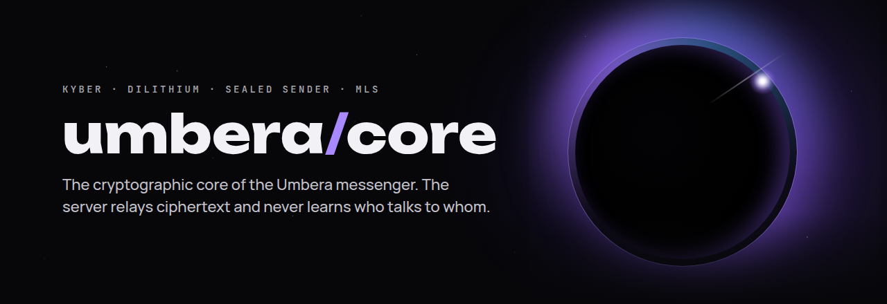
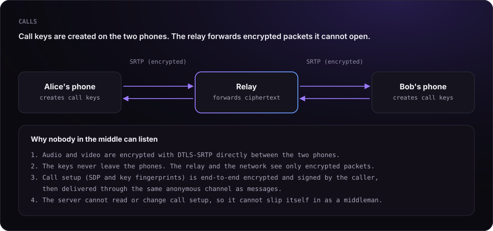

<p align="center">
  
</p>

# Proof: nobody but the recipient can read your messages or listen to your calls

This document makes two precise claims and gives you the means to check each of them yourself.
Nothing here asks to be taken on trust: every step points to code you can read, tests you can run,
or traffic you can capture.

## The claims

1. **Messages.** Only the intended recipient can read a message. The Umbera server, the hosting
   provider, the network and anyone who copies the server's database see only ciphertext.
2. **Calls.** Only the two participants can hear or see a call. The relay that forwards call traffic
   and anyone on the network see only encrypted packets, and the server cannot insert itself between
   the participants.

## Assumptions

A proof is only as honest as its assumptions. These claims hold under the following conditions:

| Assumption | Why it matters |
|---|---|
| The participants' phones are not compromised | Malware on a device can read the screen; no messenger can prevent that |
| The recipient does not share the content | Encryption cannot stop someone from forwarding what they received |
| The standard primitives are secure | ML-KEM-1024 or X25519, AES-256-GCM, HKDF-SHA256, DTLS-SRTP |
| You verify a contact's keys when it matters | Key transparency and key pinning warn you if a contact's keys change |

---

## 1. Messages

### How it works

```
plaintext
  └─ Double Ratchet (per conversation, keys only on the two phones)
       └─ inner package: sender identity + ratchet ciphertext
            └─ sealed to the recipient:
                 ephemeral X25519  +  ML-KEM-1024 (Kyber) encapsulation
                 → HKDF-SHA256 → AES-256-GCM
                      └─ padded to a fixed size bucket
                           └─ delivered to a mailbox address only the two peers can compute
```

The server receives a mailbox address and a padded ciphertext. The key needed to open it is derived
from the recipient's private keys, which are generated on the recipient's phone and never leave it.

### Where to check it in the code

| Step | File | What to look for |
|---|---|---|
| Ratchet encryption | [`DoubleRatchet.kt`](../kotlin/src/commonMain/kotlin/app/umbera/core/crypto/DoubleRatchet.kt) | message keys derived and discarded on the device |
| Sealing to the recipient | [`MessageEncryption.kt`](../kotlin/src/commonMain/kotlin/app/umbera/core/crypto/MessageEncryption.kt) | `createSealedSenderHybridPQ`: fresh ephemeral key per message, Kyber encapsulation, AES-256-GCM |
| Combining both secrets | [`HybridKeyExchange.kt`](../kotlin/src/commonMain/kotlin/app/umbera/core/crypto/HybridKeyExchange.kt) | X25519 and Kyber secrets fed into one HKDF |
| Primitives | [`primitives.rs`](../core/src/primitives.rs) | ML-KEM-1024, ML-DSA-65, X25519, AES-256-GCM from RustCrypto and dalek |
| Mailbox addresses | [`MessageEncryption.kt`](../kotlin/src/commonMain/kotlin/app/umbera/core/crypto/MessageEncryption.kt) | `rendezvousIdEpoch`: derived from the two peers' shared secret |
| Padding | [`RendezvousPadding.kt`](../kotlin/src/commonMain/kotlin/app/umbera/core/crypto/RendezvousPadding.kt) | fixed size buckets |
| Key substitution detection | [`KeyTransparencyVerifier.kt`](../kotlin/src/commonMain/kotlin/app/umbera/core/crypto/KeyTransparencyVerifier.kt) | Merkle inclusion proofs and signed tree heads |

### What a delivered message looks like to the server

A stored message consists of a mailbox address, an opaque ciphertext, a type (`message` or `signal`)
and timestamps. There is no sender field, no recipient field and no account identifier attached to it.

### Run it yourself

```bash
git clone https://github.com/Vahe327/UMBERA
cd UMBERA/core
cargo test
```

The test suite checks every primitive against known-answer vectors and runs ML-KEM-1024 and ML-DSA-65
end to end.

[`tests/proof.rs`](../core/tests/proof.rs) rebuilds the exact sealing used for every message
(ephemeral X25519 + Kyber → HKDF-SHA256 → AES-256-GCM) and proves each property directly:

```bash
cargo test --test proof
```

```
test the_recipient_can_read_the_message ... ok
test the_ciphertext_does_not_contain_the_message ... ok
test anyone_with_other_keys_cannot_read_it ... ok
test breaking_only_x25519_is_not_enough ... ok
test breaking_only_kyber_is_not_enough ... ok
test a_tampered_message_is_rejected ... ok
test every_message_is_sealed_with_fresh_keys ... ok
test result: ok. 7 passed; 0 failed
```

`breaking_only_x25519_is_not_enough` is the post-quantum guarantee: even an attacker who could break
X25519 (for example with a future quantum computer) cannot open a message without the recipient's
Kyber key.

---

## 2. Calls

<p align="center"></p>

### How it works

- Audio and video use **DTLS-SRTP**, the encryption built into WebRTC. The DTLS handshake runs
  **directly between the two phones**, so the media keys are created on the phones and never leave them.
- When a direct connection is impossible, traffic goes through a relay (TURN). The relay forwards
  SRTP packets. It never takes part in the DTLS handshake, so it never has the keys.
- A relay or server could only listen in by swapping the DTLS fingerprints during call setup
  (a man-in-the-middle attack). In Umbera, call setup is **end-to-end encrypted with the same scheme
  as messages and signed by the caller**, then delivered through the anonymous mailbox channel. The
  server cannot read the fingerprints and cannot change them without breaking the signature.
  The code is in [`CallSignaling.kt`](../kotlin/src/commonMain/kotlin/app/umbera/core/call/CallSignaling.kt):
  `encryptSignaling` seals every SDP and ICE message, and `decryptSignaling` rejects anything whose
  signature does not match the caller's key (`decryptMessageRaw` in
  [`MessageEncryption.kt`](../kotlin/src/commonMain/kotlin/app/umbera/core/crypto/MessageEncryption.kt)
  throws `Invalid message signature`).
- Group calls connect participants directly to each other. There is no server that mixes or decodes media.

### Verify it with a packet capture

You can confirm with standard tools that no unencrypted media leaves your phone:

1. Connect a phone to a Wi-Fi network you control and capture its traffic with Wireshark
   (for example on a laptop sharing its connection).
2. Make an Umbera call.
3. Filter the capture with `dtls || rtp || srtp`.
4. You will see a DTLS handshake followed only by encrypted SRTP packets. Wireshark cannot decode any
   audio or video from them, and there is no plain RTP stream.

---

## Found a flaw?

If you can break either claim, we want to know first. Report it privately as described in
[SECURITY.md](../SECURITY.md).

<p align="center"><sub>© 2026 Vahe Aramyan · <a href="https://umbera.app">umbera.app</a> · <a href="../LICENSE.md">PolyForm Strict 1.0.0</a></sub></p>
